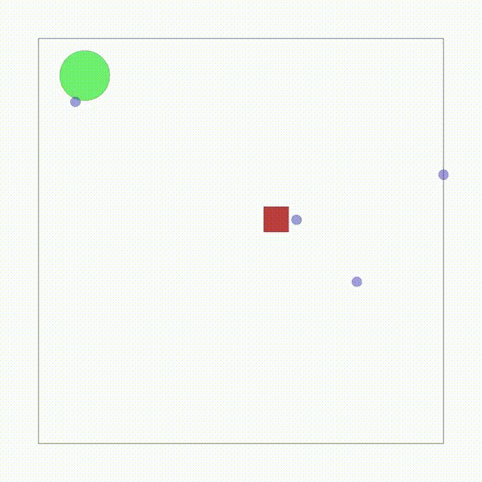
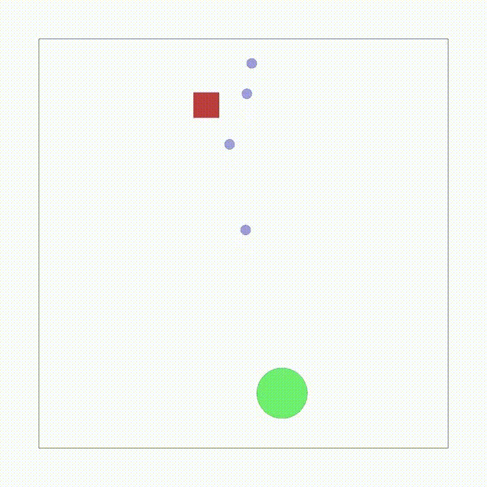
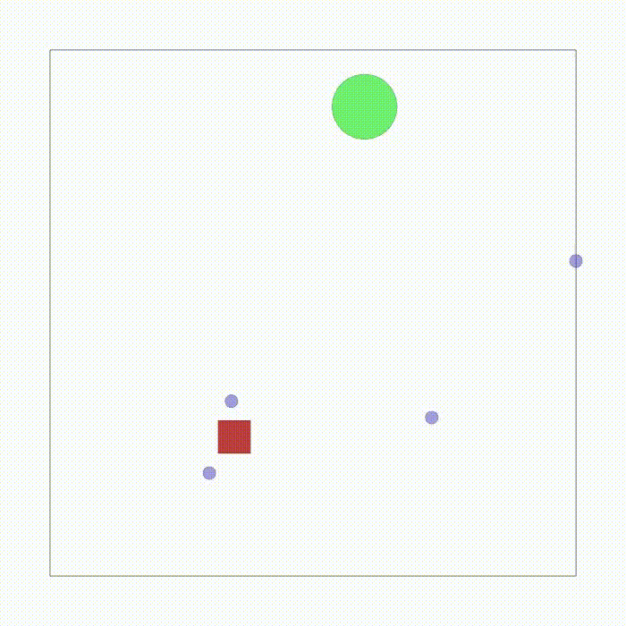

# Reproduction Experiments

This repository reproduces the benchmark experiment in the VMAS paper. 

## Reproduction Results

|  |  |  |
|:-:|:-:|:-:|
| CPPO | MAPPO | IPPO |


## Running Experiments
### Train alogorithms(CPPO, MAPPO, IPPO)
you can use `train.py` with arguments specify in you command or use `multi_run.py` to run some experiments. 
```shell
python train.py --algorithm CPPO --scenario_name transport --n_agents 4
```
- `restore`: restore from the latest checkpoint
### Add Gaussian Noise
use `--add_noise` to run the `train.py`
```shell
python train.py --algorithm CPPO --scenario_name transport --n_agents 4 --add_noise
```
### Add Expert Network
you should checkout to the `IL` branch and use `train.py` to run this experiments. `--use_expert` is needed in your command.
```shell
python train.py --algorithm CPPO --scenario_name transport --n_agents 4 --use_expert
```

## Reference
- VMAS: https://github.com/proroklab/VectorizedMultiAgentSimulator
- MultiPPOTrainer: https://github.com/proroklab/rllib_differentiable_comms
- VMAS use example: https://github.com/proroklab/HetGPPO

```
@inproceedings{bettini2022vmas,
  title={Vmas: A vectorized multi-agent simulator for collective robot learning},
  author={Bettini, Matteo and Kortvelesy, Ryan and Blumenkamp, Jan and Prorok, Amanda},
  booktitle={International Symposium on Distributed Autonomous Robotic Systems},
  pages={42--56},
  year={2022},
  organization={Springer}
}
```